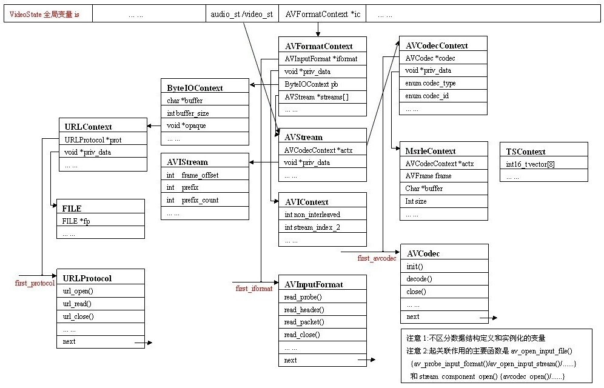

## ffmpeg主要数据结构之间的联系



​									    图一

#### VideoState

​	**ffplay**中定义的总控结构，把其他核心数据结构整合在一起，起一个中转的作用，便于在各个子结构之间跳转。

#### AVFormatContext

​	**libavformat**中定义的结构,表示程序运行的当前文件容器格式使用的上下文，着重于所有文件容器共有的属性(并且是在程序运行时才能确定其值)和程序运行后仅一个实例。

```c
typedef struct AVFormatContext  // format I/O context
{
	struct AVInputFormat *iformat;	// 关联相应的文件容器格式
	void *priv_data;		// 指向具体的文件容器格式的上下文Context和priv_data_size配对使用
	ByteIOContext pb;		// 广泛意义的输入文件
	int nb_streams;			// 广义输入文件中媒体流计数
	AVStream *streams[MAX_STREAMS];	// 关联音视频流
} AVFormatContext;
```

#### AVInputFormat

​	**libavformat**中定义的结构,一种文件容器格式对应一个AVInputFormat结构，在程序运行时有多个实例。

```c
typedef struct AVInputFormat
{
	const char *name;			// 文件容器格式名，用于人性化阅读，维护代码
	int priv_data_size;			// 标示具体的文件容器格式对应的Context的大小
	int(*read_probe)(AVProbeData*);
	int(*read_header)(struct AVFormatContext *, AVFormatParameters *ap);
	int(*read_packet)(struct AVFormatContext *, AVPacket *pkt);
	int(*read_close)(struct AVFormatContext*);
	const char *extensions;			// 文件扩展名
	struct AVInputFormat *next;		// 用于把ffplay 支持的所有文件容器格式链成一个链表。
} AVInputFormat;
```

#### ByteIOContext

​	**libavformat**中定义的结构，扩展URLProtocol结构成内部有缓冲机制的广泛意义上的文件，改善广义输入文件的IO性能。通过内部字段opaque跟URLProtocol结构关联。

```c
typedef struct ByteIOContext
{
    unsigned char *buffer;		// 缓存首地址
    int buffer_size;			// 缓存大小
    unsigned char *buf_ptr, *buf_end;	// 缓存读指针和末指针
    void *opaque;	// 关联URLContext
    int(*read_buf)(void *opaque, uint8_t *buf, int buf_size);
    int(*write_buf)(void *opaque, uint8_t *buf, int buf_size);
    offset_t(*seek)(void *opaque, offset_t offset, int whence);
    offset_t pos;    // position in the file of the current buffer
    int must_flush;  // true if the next seek should flush
    int eof_reached; // true if eof reached
    int write_flag;  // true if open for writing
    int max_packet_size;	// 如果非0，表示最大数据帧大小，用于分配足够的缓存。
    int error;       // contains the error code or 0 if no error happened
} ByteIOContext;
```

#### URLContext

​	**libavformat**中定义的结构,表示程序运行的当前广义输入文件使用的上下文。

```c
typedef struct URLContext
{
    struct URLProtocol *prot;	// prot 字段关联相应的广义输入文件
    int flags;			// 文件读写类型
    int max_packet_size;	// 如果非0，表示最大包大小，用于分配足够的缓存。
    void *priv_data;		// 在本例中，关联一个文件句柄
    char filename[1];		// specified filename
} URLContext;
```

#### URLProtocol

​	**libavformat**中定义的结构,表示广义的输入文件着重于功能函数，瘦身后的ffplay只支持file一种输入文件。

```c
typedef struct URLProtocol
{
    const char *name;
    int(*url_open)(URLContext *h, const char *filename, int flags);
    int(*url_read)(URLContext *h, unsigned char *buf, int size);
    int(*url_write)(URLContext *h, unsigned char *buf, int size);
    offset_t(*url_seek)(URLContext *h, offset_t pos, int whence);
    int(*url_close)(URLContext *h);
    struct URLProtocol *next;	// 用于把所有支持的广义的输入文件连接成链表，便于遍历查找。
} URLProtocol;
```

#### AVStream

​	**libavformat**中定义的结构，表示当前媒体流的上下文，着重于所有媒体流共有的属性(并且是在程序运行时才能确定其值)和关联其他结构的字段。

```C
typedef struct AVStream
{
	AVCodecContext *actx;	// 关联当前音视频媒体使用的编解码器
	void *priv_data;		// AVIStream 关联解析各个具体媒体流与文件容器有关的独有的属性
	AVRational time_base;	// 由 av_set_pts_info()函数初始化
	AVIndexEntry *index_entries;
  	// only used if the format does not support seeking natively
	int nb_index_entries;
	int index_entries_allocated_size;
	double frame_last_delay;	// 帧最后延迟
 } AVStream;
```

#### AVCodecContext

​	**libavformat**中定义的结构，AVCodecContext结构表示程序运行的当前Codec使用的上下文，着重于所有Codec共有的属性。codec 和priv_data 关联其他结构的字段，便于在数据结构间跳转。

```c
typedef struct AVCodecContext
{
	int bit_rate;
	int frame_number;		// audio or video frame number
	unsigned char *extradata;	// Codec的私有数据，对Audio是WAVEFORMATEX结构扩展字节。
	int extradata_size;		// 对Video是BITMAPINFOHEADER后的扩展字节
	int width, height;		// video only
	enum PixelFormat pix_fmt;	// 输出像素格式/视频图像格式
	int sample_rate;			// samples per sec  // audio only
	int channels;
	int bits_per_sample;
	int block_align;
	struct AVCodec *codec;		// 指向Codec 的指针
	void *priv_data;			// AVCodec结构中的priv_data_size 配对使用
	enum CodecType codec_type;	// see CODEC_TYPE_xxx
	enum CodecID codec_id;		// see CODEC_ID_xxx
	int(*get_buffer)(struct AVCodecContext *c, AVFrame *pic);
	void(*release_buffer)(struct AVCodecContext *c, AVFrame *pic);
	int(*reget_buffer)(struct AVCodecContext *c, AVFrame *pic);
	int internal_buffer_count;
	void *internal_buffer;
	struct AVPaletteControl *palctrl;
}AVCodecContext;
```

#### AVCodec

​	**libavcodec**中定义的结构，表示音视频编解码器，着重于功能函数，一种媒体类型对应一个AVCodec结构，在程序运行时有多个实例串联成链表便于查找。

```c
typedef struct AVCodec
{
	const char *name;		// 标示Codec的名字
	enum CodecType type;	// 标示Codec的类型，有Video ，Audio，Data 等类型
	enum CodecID id;		// 标示Codec的ID，有CODEC_ID_MSRLE，CODEC_ID_TRUESPEECH 等
	int priv_data_size;		// 标示具体的Codec对应的Context的大小
	// 标示Codec对外提供的操作
	int(*init)(AVCodecContext*);
	int(*encode)(AVCodecContext *, uint8_t *buf, int buf_size, void *data);
	int(*close)(AVCodecContext*);
	int(*decode)(AVCodecContext *, void *outdata, int *outdata_size, uint8_t *buf, int buf_size);
	int capabilities;		// 标示Codec的能力，在瘦身后的ffplay中没太大作用，可忽略

	struct AVCodec *next;	// 用于把所有Codec串成一个链表，便于遍历
}AVCodec;
```