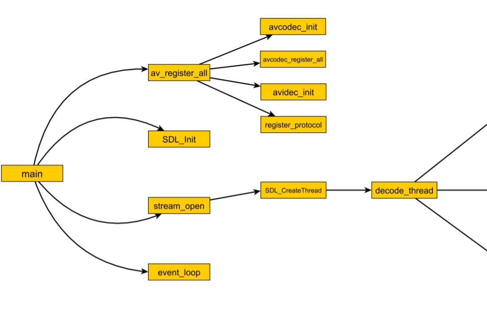
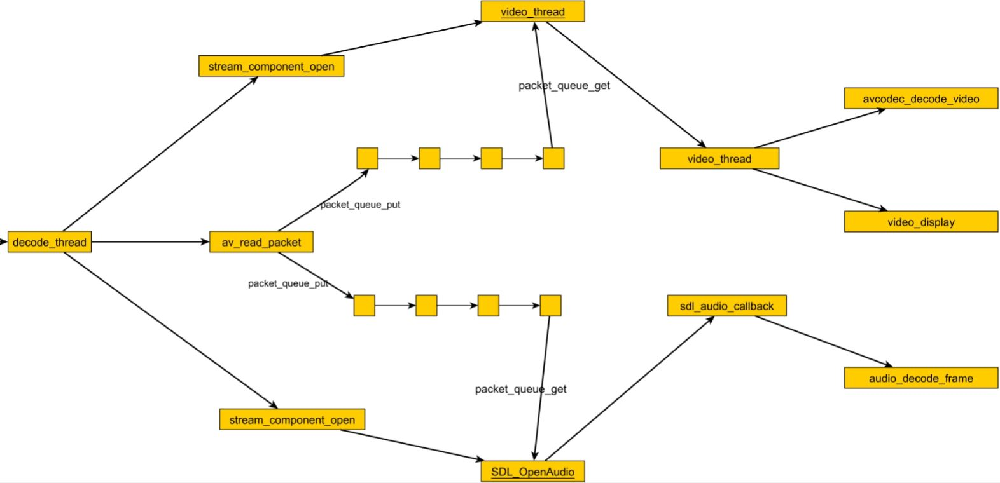
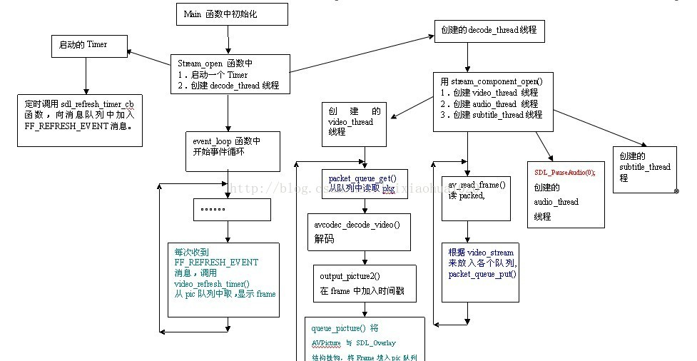

## ffplay的架构分析

#### ffplay流程

##### ffplay整体流程

##### 第一部分

mian函数中主要调用右侧的四个函数：

+ av_register_all
  + avcodec_init

  + avcodec_register_all

    把所有的解码器用链表的方式都串连起来，链表头指针是first_avcodec。

  + avidec_init

     把所有的输入文件格式用链表的方式都串连起来，链表头指针是first_iformat。

  + register_protocol

    把所有的输入协议用链表的方式都串连起来，比如tcp/udp/file 等，链表头指针是first_protocol。

+ SDL_Init

  SDL初始化函数。

+ stream_open

  打开流。主要功能是分配全局总控数据结构，初始化相关参数，启动文件解析线程。

  通过SDL_CreateThread创建线程，调用decode_thread函数(在下图分析)。

+ event_loop

  SDL事件循环处理函数。

##### 第二部分

decode_thread函数主要调用三个函数：

+ av_open_input_file/av_read_packet

  打开文件，读取数据包，然后分别放到音视频队列。

+ stream_component_open

  启动线程，执行video_thread函数，从视频队列获取视频数据，然后解码和显示。

+ stream_component_open

  启动SDL的线程，执行sdl_audio_callback，从音频队列获取音频数据，编解码和输出。

#### 参考资料

+  [ffplay.c函数结构简单分析](http://blog.csdn.net/leixiaohua1020/article/details/39762143)

+  [ffmpeg 架构介绍一：框架流程图](http://xcshen.blog.51cto.com/2835389/565929/)

  ​

