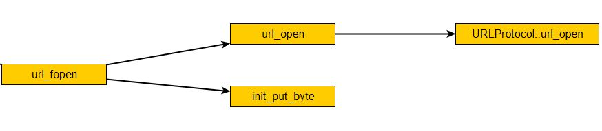

## ffmpeg打开文件过程

#### **打开文件过程**



+ 函数声明

  ```c
  // 打开广义文件ByteIOContext
  int url_fopen(ByteIOContext *s, const char *filename, int flags)

  // 打开广义输入文件。此函数主要有三部分逻辑，首先从文件路径名中分离出协议字符串
  // 到proto_str字符数组中，接着遍历URLProtocol 链表查找匹配proto_str字符数组中
  // 的字符串来确定使用的协议，最后调用相应的文件协议的打开函数打开输入文件。
  int url_open(URLContext **puc, const char *filename, int flags)

  // 表示广义的输入文件，着重于功能函数
  typedef struct URLProtocol
  {
      const char *name;
      int(*url_open)(URLContext *h, const char *filename, int flags);
      int(*url_read)(URLContext *h, unsigned char *buf, int size);
      int(*url_write)(URLContext *h, unsigned char *buf, int size);
      offset_t(*url_seek)(URLContext *h, offset_t pos, int whence);
      int(*url_close)(URLContext *h);
      // 用于把所有支持的广义的输入文件连接成链表，便于遍历查找。
      struct URLProtocol *next;
  } URLProtocol;

  int init_put_byte(ByteIOContext *s, 
  				  unsigned char *buffer, 
  				  int buffer_size, 
  				  int write_flag, 
  				  void *opaque, 
  				  int(*read_buf)(void *opaque, uint8_t *buf, int buf_size),
  				  int(*write_buf)(void *opaque, uint8_t *buf, int buf_size), 
  				  offset_t(*seek)(void *opaque, offset_t offset, int whence));
  ```

+ url_fopen

  + filename表示输入的广义文件名。
  + flags表示广义文件的读写模式。
  + s: 为ByteIOContext类型，内部的数据缓存结构，改善广义输入文件的IO性能。通过内部字段opaque跟URLProtocol结构关联。

  **注：具体的关联关系可以参考图一**

+ url_open

  + puc为URLContext结构，表示程序运行的当前广义输入文件使用的上下文。

  + 其他输入参数跟url_fopen一样。

  + 功能

    + 遍历first_protocol链表，找到程序支持的文件格式。

      ```c
      // 支持的文件格式在av_register_all中初始化
      void av_register_all中初始化(void)
        
      // 链表的节点类型
      // 表示广义的输入文件，着重于功能函数，瘦身后的ffplay只支持file一种输入文件
      typedef struct URLProtocol
      {
          const char *name;
          int(*url_open)(URLContext *h, const char *filename, int flags);
          int(*url_read)(URLContext *h, unsigned char *buf, int size);
          int(*url_write)(URLContext *h, unsigned char *buf, int size);
          offset_t(*url_seek)(URLContext *h, offset_t pos, int whence);
          int(*url_close)(URLContext *h);
          // 用于把所有支持的广义的输入文件连接成链表，便于遍历查找。
          struct URLProtocol *next;			
      } URLProtocol;
      ```

    + 如果找到就分配URLContext结构，并初始化相应的结构

      ```c
      typedef struct URLContext
      {
          struct URLProtocol *prot;	// prot 字段关联相应的广义输入文件
          int flags;
          int max_packet_size;	// 如果非0，表示最大包大小，用于分配足够的缓存。
          void *priv_data;		// 在本例中，关联一个文件句柄
          char filename[1];		// specified filename
      } URLContext;
      ```

      + prot: 使用文件所属的类型结构。

      + flag: 文件的读写类型。

      + max_packet_size：默认值为0，表示流式文件。

      + filename：表示输入的文件名，这边 char filename[1]为了节省内容(同时内存会连续)，根据filename的实际大小复制。

        ```c
        // 分配URLContext大小的时候多分配strlen(filename)
        uc = av_malloc(sizeof(URLContext) + strlen(filename));

        // 所以下面的strcpy没有问题 
        strcpy(uc->filename, filename);
        ```

      + 在url_open中priv_data成员变量没有被赋值。

        priv_data在URLProtocol结构的url_open中被赋值，当文件类型为本地文件的时候priv_data即为本地文件句柄，结构如下：

        ```c
        // 用file协议相应函数初始化URLProtocol 结构。
        URLProtocol file_protocol =
        {
            "file",
        	file_open,
        	file_read,
        	file_write,
        	file_seek,
        	file_close,
        };

        // 调用URLProtocol::url_open即调用file_open
        h->priv_data = (void*)(size_t)fd;
        ```

+ init_put_byte

  ```c
  // 初始化广义文件ByteIOContext 数据结构，如果错误就关闭文件，释放内部缓存，返回错误码
  int init_put_byte(ByteIOContext *s, 
  				  unsigned char *buffer, 
  				  int buffer_size, 
  				  int write_flag, 
  				  void *opaque, 
  				  int(*read_buf)(void *opaque, uint8_t *buf, int buf_size),
  				  int(*write_buf)(void *opaque, uint8_t *buf, int buf_size), 
  				  offset_t(*seek)(void *opaque, offset_t offset, int whence));
  ```

  + s: ByteIOContext*类型，需要被初始化的对象。

  + buffer: 缓存数据存放的起始地址。

  + buffer_size: 缓存的最大字节数量。

  + write_flag: 是否可写的标志。

  + opaque:  含有下面方法的结构体指针，一般情况下面使用URLContext类型的指针。

  + int(*read_buf) : 读取数据到缓存中(具体实现依赖于opaque的类型)

  + int(*write_buf) : 写数据到缓存中(具体实现依赖于opaque的类型)

  + offset_t(*seek) : 在缓存中做seek操作(具体实现依赖于opaque的类型)

    ```c
    // 简单中转读操作函数。
    static int url_read_buf(void *opaque, uint8_t *buf, int buf_size)
    {
        URLContext *h = opaque;
        return url_read(h, buf, buf_size);
    }

    // 简单中转seek 操作函数。
    static offset_t url_seek_buf(void *opaque, offset_t offset, int whence)
    {
        URLContext *h = opaque;
        return url_seek(h, offset, whence);
    }
    ```

#### **识别文件容器类型**

```c
// 先读PROBE_BUF_MIN(2048)字节文件开始数据识别文件格式，
// 如果不能识别文件格式，就把识别文件缓存以2 倍的增长扩大再读文件开始数据识别，直到识别出文件格式或者超过131072 字节缓存。
for (probe_size = PROBE_BUF_MIN; probe_size <= PROBE_BUF_MAX && !fmt; 
     	probe_size <<= 1)
{
	// 重新分配缓存，重新读文件开始数据。
    pd->buf = av_realloc(pd->buf, probe_size);
    pd->buf_size = url_fread(pb, pd->buf, probe_size);
    // 把文件读指针seek 到文件开始处，便于下一次读。
    if (url_fseek(pb, 0, SEEK_SET) == (offset_t) - EPIPE)
    {
		// 如果seek错误，关闭文件，再重新打开。
        url_fclose(pb);
	    // 重新打开文件出错，设置错误码，跳到错误处理。
        if (url_fopen(pb, filename, URL_RDONLY) < 0)
        {
             file_opened = 0;
             err = AVERROR_IO;
             goto fail;
          }
     }
// 重新识别文件格式，因为一次比一次数据多，数据少的时候可能识别不出，数据多了可能就可以了。
     fmt = av_probe_input_format(pd, 1);
}
```

+ **av_probe_input_format**之前的代码都是读取数据,然后调用**av_probe_input_format**去探测文件的容器类型。

+ **av_probe_input_format**中会遍历全部支持的容器类型，分别调用其probe函数进行探测

  ```c
  AVInputFormat avi_iformat =
  {
  	"avi",
  	sizeof(AVIContext),
  	avi_probe,
  	avi_read_header,
  	avi_read_packet,
  	avi_read_close,
  };

  int avidec_init(void)
  {
      av_register_input_format(&avi_iformat);
      return 0;
  }
  // 这边因为被裁剪过所有只支持一种了
  ```

+ 识别出文件容器之后，初始化AVFormatContext对象

  ```c
  typedef struct AVFormatContext  // format I/O context
  {
  	struct AVInputFormat *iformat;	// 关联相应的文件容器格式
      // 指向具体的文件容器格式的上下文Context和priv_data_size配对使用
  	void *priv_data;	
  	ByteIOContext pb;		// 广泛意义的输入文件 ????  
  	int nb_streams;			// 广义输入文件中媒体流计数
  	AVStream *streams[MAX_STREAMS];	// 关联音视频流
  } AVFormatContext;
  ```

  先关联AVInputFormat *iformat、ByteIOContext pb，priv_data跟AVInputFormat相关(此处为AVIContext)。然后调用AVInputFormat的read_header函数创建流对象关联AVStream *streams[MAX_STREAMS]和nb_streams，这里即调用avi_read_header。

  ```c
  // 表示当前媒体流的上下文，着重于所有媒体流共有的属性
  typedef struct AVStream
  {
  	AVCodecContext *actx;	// 关联当前音视频媒体使用的编解码器
  	void *priv_data;	// AVIStream 关联解析各个具体媒体流与文件容器有关的独有的属性
  	AVRational time_base;	// 由 av_set_pts_info()函数初始化
  	AVIndexEntry *index_entries; 
  	int nb_index_entries;
  	int index_entries_allocated_size;
  	double frame_last_delay;	// 帧最后延迟
  } AVStream;
  ```

#### **读取帧数据**

​	ffplay在打开文件之后分别读取音视频帧数据(**AVPacket**)，然后写入音视频队列。

```c
// 一次读取一个数据包，在瘦身后的ffplay 中，一次读取一个完整的数据帧，数据包。
int av_read_packet(AVFormatContext *s, AVPacket *pkt)
{
    return s->iformat->read_packet(s, pkt);
}
```